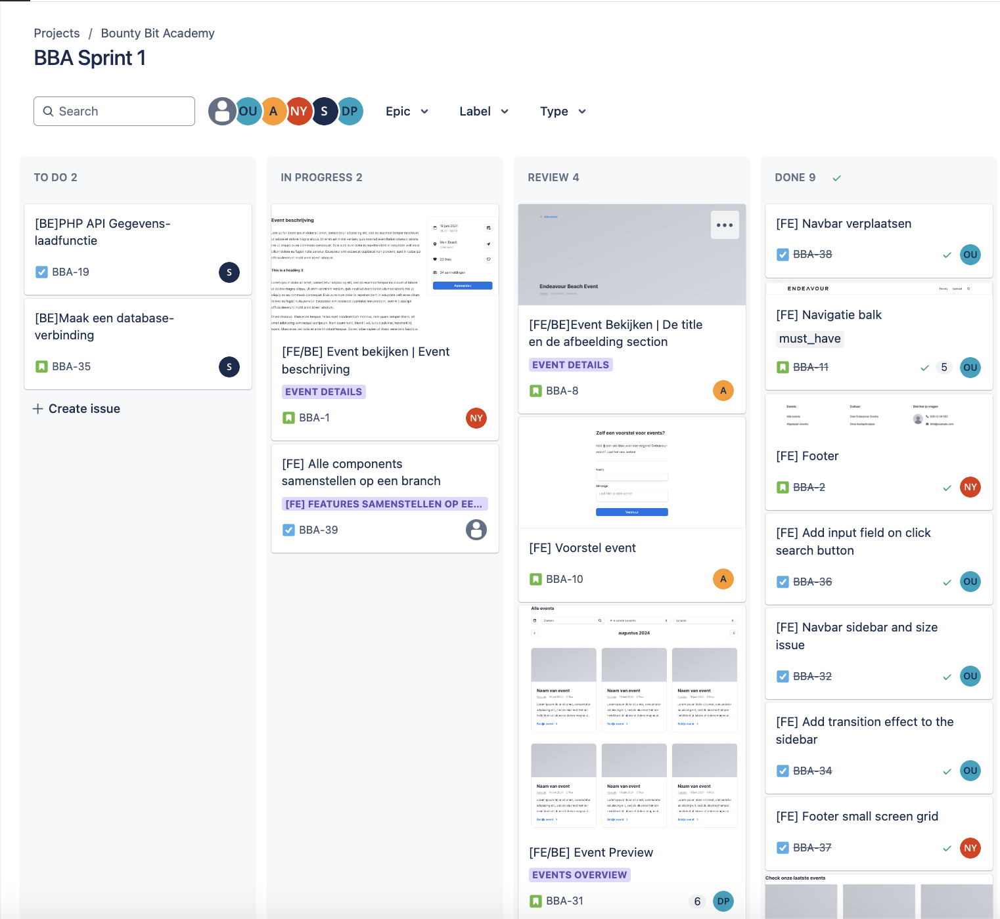
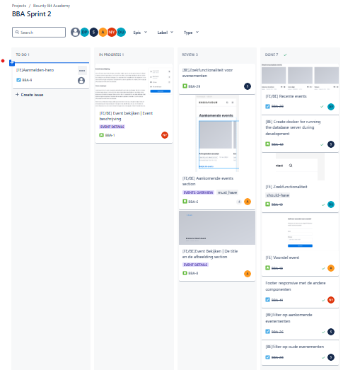
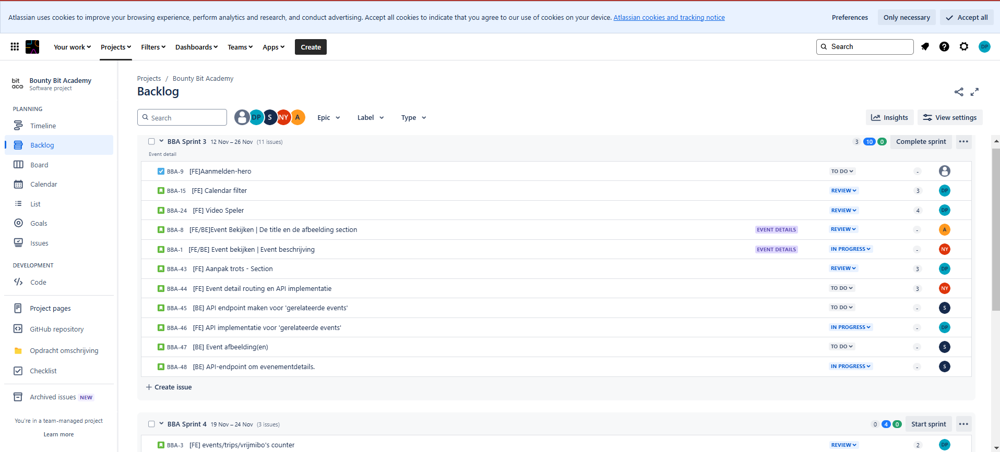
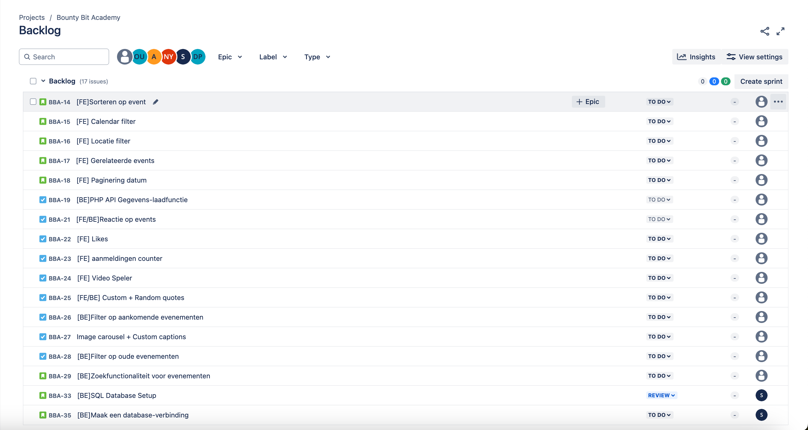

## **User Stories**

### **1. Home Page met Minimalistic Design**

| **US-id** | **Wie**              | **Wat**                                                                 | **Waarom**                                                                                          | **Realistisch?**                                                                                                  | **Prioriteit** | **Tijd Indicatie** | **Accept Criteria**                                                                                                                                          |
|-----------|----------------------|------------------------------------------------------------------------|-----------------------------------------------------------------------------------------------------|------------------------------------------------------------------------------------------------------------------|---------------|-------------------|-----------------------------------------------------------------------------------------------------------------------------------------------------------------|
| **US-01** | Als gebruiker        | Wil ik een minimalistische homepagina met eenvoudige navigatie.        | Zodat ik gemakkelijk toegang heb tot alle belangrijke componenten en events.                        | Ja, wel mogelijk om te doen, want hier aan gaan we veel tijd besteden              | Must have     |  4 dagen            | - Een minimalistisch ontwerp is geïmplementeerd. - Homepagina toont secties voor events. - Zoekbalk en navigatie werken zonder fouten.                     |

---

### **2. Creëren van Database en API**

| **US-id** | **Wie**              | **Wat**                                                                 | **Waarom**                                                                                          | **Realistisch?**                                                                                                  | **Prioriteit** | **Tijd Indicatie** | **Accept Criteria**                                                                                                                                          |
|-----------|----------------------|------------------------------------------------------------------------|-----------------------------------------------------------------------------------------------------|------------------------------------------------------------------------------------------------------------------|---------------|-------------------|-----------------------------------------------------------------------------------------------------------------------------------------------------------------|
| **US-02** | Als ontwikkelaar     | Wil ik een database maken en API bouwen met JSON-data.                 | Zodat ik gegevens kan ophalen en weergeven op het scherm.                                           | Ja, dit is realistisch door gebruik te maken van PHP, MySQL en het verwerken van JSON-gegevens.                       | Must have     | 2 dagen        | - JSON-data opgeschoond en database gemaakt. - API routes zijn getest. - Endpoint-documentatie is beschikbaar.                                            |

---

### **3. Responsiviteit voor Mobiel en Desktop**

| **US-id** | **Wie**              | **Wat**                                                                 | **Waarom**                                                                                          | **Realistisch?**                                                                                                  | **Prioriteit** | **Tijd Indicatie** | **Accept Criteria**                                                                                                                                          |
|-----------|----------------------|------------------------------------------------------------------------|-----------------------------------------------------------------------------------------------------|------------------------------------------------------------------------------------------------------------------|---------------|-------------------|-----------------------------------------------------------------------------------------------------------------------------------------------------------------|
| **US-03** | Als gebruiker        | Wil ik dat de website volledig responsive is voor mobiel en desktop.   | Zodat ik gemakkelijk events kan bekijken op elk apparaat.                                           | Ja, realistisch met behulp van Tailwind CSS en React om de layout voor verschillende schermformaten aan te passen.   | Must have     | 2 weken           | - Website getest op desktop, tablet, en mobiel. - Layout schaalt correct zonder overlappingen. - Consistente gebruikerservaring.                         |

---

### **4. Navbar met Navigatie en Zoekfunctionaliteit**

| **US-id** | **Wie**              | **Wat**                                                                 | **Waarom**                                                                                          | **Realistisch?**                                                                                                  | **Prioriteit** | **Tijd Indicatie** | **Accept Criteria**                                                                                                                                          |
|-----------|----------------------|------------------------------------------------------------------------|-----------------------------------------------------------------------------------------------------|------------------------------------------------------------------------------------------------------------------|---------------|-------------------|-----------------------------------------------------------------------------------------------------------------------------------------------------------------|
| **US-04** | Als gebruiker        | Wil ik een navigatiebalk met links en zoekfunctionaliteit.             | Zodat ik snel tussen pagina's kan wisselen en events kan zoeken.                                    | Ja, realistisch omdat React Routing kan worden toegepast voor navigatie en zoekfunctionaliteit.         | Must have     | 3 dagen          | - Navbar bevat werkende links. - Zoekfunctie filtert events op naam. - Responsief ontwerp voor desktop en mobiel.                                          |

---

### **5. Aankomende Events Sectie**

| **US-id** | **Wie**              | **Wat**                                                                 | **Waarom**                                                                                          | **Realistisch?**                                                                                                  | **Prioriteit** | **Tijd Indicatie** | **Accept Criteria**                                                                                                                                          |
|-----------|----------------------|------------------------------------------------------------------------|-----------------------------------------------------------------------------------------------------|------------------------------------------------------------------------------------------------------------------|---------------|-------------------|-----------------------------------------------------------------------------------------------------------------------------------------------------------------|
| **US-05** | Als ontwikkelaar        | Wil ik een sectie zien met 3 aankomende events en optie voor meer.     | Zodat gebruikers voorbereid zijn op aankomende events.                                                       |  Ja, door gebruik van API om data op te halen en React components om sectie te tonen.                     | Should have   | 2 dagen              | - Toont 3 aankomende events. - Knop leidt naar alle aankomende events. - Klikbare kaarten leiden naar specifieke eventpagina's.                          |

---

### **6. Vorige Events Sectie**

| **US-id** | **Wie**              | **Wat**                                                                 | **Waarom**                                                                                          | **Realistisch?**                                                                                                  | **Prioriteit** | **Tijd Indicatie** | **Accept Criteria**                                                                                                                                          |
|-----------|----------------------|------------------------------------------------------------------------|-----------------------------------------------------------------------------------------------------|------------------------------------------------------------------------------------------------------------------|---------------|-------------------|-----------------------------------------------------------------------------------------------------------------------------------------------------------------|
| **US-06** | Als ontwikkelaar        | Wil ik een sectie zien met 3 vorige events en optie voor meer.         | Zodat gebruikers eerdere activiteiten kunnen terugzien.                                                        | Ja, door gebruik te maken van dezelfde API data en herbruikbare React components als de aankomende sectie.         | Should have   | 2 dagen             | - Toont 3 vorige events. - Knop leidt naar alle vorige events. - Klikbare kaarten leiden naar specifieke eventpagina's.                                   |

---

### **7. Events Overzicht met Filters en Paginatie**

| **US-id** | **Wie**              | **Wat**                                                                 | **Waarom**                                                                                          | **Realistisch?**                                                                                                  | **Prioriteit** | **Tijd Indicatie** | **Accept Criteria**                                                                                                                                          |
|-----------|----------------------|------------------------------------------------------------------------|-----------------------------------------------------------------------------------------------------|------------------------------------------------------------------------------------------------------------------|---------------|-------------------|-----------------------------------------------------------------------------------------------------------------------------------------------------------------|
| **US-07** | Als gebruiker        | Wil ik alle events kunnen filteren en zoeken met een kalender en zoekbalk. | Zodat ik gemakkelijk specifieke events kan vinden op basis van datum, naam, of locatie.             | Ja, realistisch door gebruik van React state voor filters en API endpoints voor gefilterde data.                     | Must have     |  4 dagen         | - Filters voor datum, locatie, en type werken. - Zoekbalk werkt. - Paginatie op maand en jaar werkt. - Klikbare kaarten leiden naar specifieke events. |

---

### **8. Suggestie Event Sectie**

| **US-id** | **Wie**              | **Wat**                                                                 | **Waarom**                                                                                          | **Realistisch?**                                                                                                  | **Prioriteit** | **Tijd Indicatie** | **Accept Criteria**                                                                                                                                          |
|-----------|----------------------|------------------------------------------------------------------------|-----------------------------------------------------------------------------------------------------|------------------------------------------------------------------------------------------------------------------|---------------|-------------------|-----------------------------------------------------------------------------------------------------------------------------------------------------------------|
| **US-08** | Als gebruiker        | Wil ik suggesties kunnen indienen voor nieuwe events.                  | Zodat mijn ideeën gehoord kunnen worden en nieuwe events georganiseerd kunnen worden.               | Ja, realistisch door een formulier te bouwen dat data via POST API naar de backend stuurt.                 | Could have    | 2 dagen            | - Formulier werkt en stuurt data naar API. - Succesmelding bij verzending. - Suggesties worden opgeslagen in database.                                   |

---

### **9. Footer en Contact Sectie**

| **US-id** | **Wie**              | **Wat**                                                                 | **Waarom**                                                                                          | **Realistisch?**                                                                                                  | **Prioriteit** | **Tijd Indicatie** | **Accept Criteria**                                                                                                                                          |
|-----------|----------------------|------------------------------------------------------------------------|-----------------------------------------------------------------------------------------------------|------------------------------------------------------------------------------------------------------------------|---------------|-------------------|-----------------------------------------------------------------------------------------------------------------------------------------------------------------|
| **US-09** | Als ontwikkelaar        | Wil ik een footer met links en contactinformatie.                      | Zodat gebruikers gemakkelijk vragen kunnen stellen en toegang hebben tot andere belangrijke secties.              | Ja, door footer te  implementeren met Tailwind CSS en React.                 | should have     | 1 dag         | - Contactinformatie is zichtbaar. - Links leiden naar de juiste secties. - Layout is responsive op alle schermformaten.                                  |

---

### **10. Navigatie via React Routing**

| **US-id** | **Wie**              | **Wat**                                                                 | **Waarom**                                                                                          | **Realistisch?**                                                                                                  | **Prioriteit** | **Tijd Indicatie** | **Accept Criteria**                                                                                                                                          |
|-----------|----------------------|------------------------------------------------------------------------|-----------------------------------------------------------------------------------------------------|------------------------------------------------------------------------------------------------------------------|---------------|-------------------|-----------------------------------------------------------------------------------------------------------------------------------------------------------------|
| **US-10** | Als gebruiker        | Wil ik kunnen navigeren door pagina's en events.             | Zodat ik specifieke events en secties snel kan bekijken.                                            | Ja, mogelijk door gebruik te maken van React Router voor client-side navigatie en component loading.                       | Must have     | 2 dagen         | - Routes werken voor alle pagina's. - Klikbare kaarten leiden naar eventpagina's. - Pagina's laden correct zonder fouten.                                 |

Dit zijn de user stories waar we de meeste tijd aan hadden besteed. De andere stories die je op die screenshots zien, waren vooral would-have of could-have features. Ze hadden geen hoge prioriteit voor ons. Pas wanneer deze belangrijkste componenten helemaal werkten, hebben we gekeken of we nog extra dingen konden toevoegen.

Hieronder zie je de screenshots van onze backlog en de sprint die toen nog in progress was:

